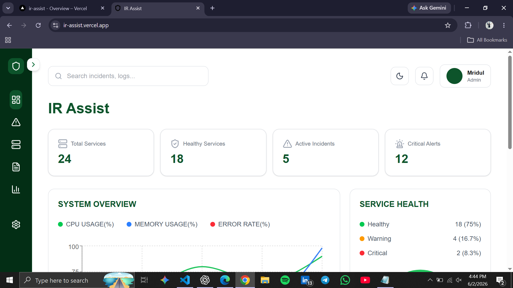
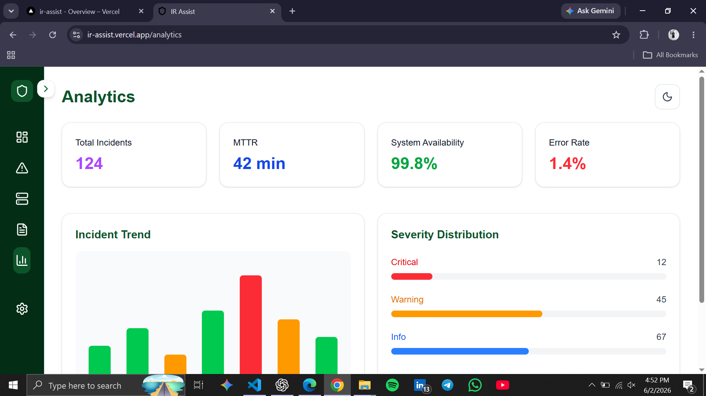
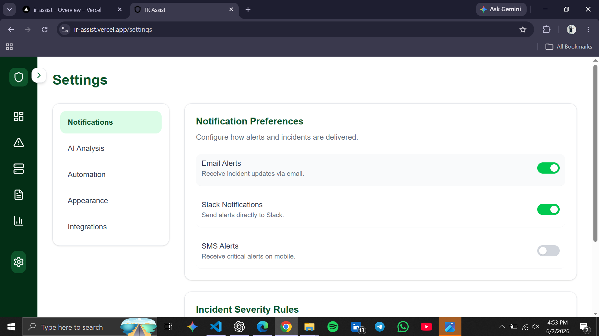

# IR Assist

AI-Powered Incident Response Dashboard built with Next.js, TypeScript, Tailwind CSS, Recharts, and Framer Motion.

## Overview

IR Assist is a modern incident management and service monitoring dashboard designed to help teams track incidents, monitor service health, analyze logs, and visualize operational metrics through an intuitive interface.

The project focuses on delivering a responsive, production-ready user experience with dark mode support, smooth animations, and scalable frontend architecture.

---

## Features

### Dashboard

* Service health overview
* Incident summary cards
* System metrics visualization
* Recent incidents section
* Logs explorer

### Incident Management

* Incident listing page
* Incident details page
* Severity and status tracking
* Search functionality

### Service Monitoring

* Service inventory
* Service details view
* Uptime and response metrics
* Search functionality

### Logs Explorer

* Structured log display
* Severity-based categorization
* Search support

### Analytics

* Incident trend visualization
* Service health distribution
* Interactive charts

### Settings

* Notification preferences
* Appearance controls
* Dark mode support
* Automation settings

### User Experience

* Responsive design
* Smooth page transitions
* Sidebar navigation
* Dark / Light mode
* Interactive animations

---

## Tech Stack

### Frontend

* Next.js 15
* React
* TypeScript
* Tailwind CSS v4

### UI & Visualization

* Recharts
* Framer Motion
* Lucide React

### Deployment

* Vercel

---

## Screenshots

### Dashboard




### Analytics


.png)

### Settings



---

## Installation

Clone the repository:

```bash
git clone <https://github.com/mridul2507/AI-Powered-INCIDENT-RESPONSE-PLATFORM>
```

Install dependencies:

```bash
npm install
```

Start development server:

```bash
npm run dev
```

---

## Build

```bash
npm run build
```

---

## Deployment

The application is deployed on Vercel.

Live Demo:

https://ir-assist.vercel.app/


---

## Future Improvements

* Authentication & Role Management
* Real-time Monitoring
* Backend API Integration
* Database Support
* AI-Powered Root Cause Analysis
* Alerting & Notification System
* Incident Automation Workflows

---

## Project Status

Frontend Phase: Complete

Current Focus:

* Backend Development
* Database Integration
* AI Features
* Production Enhancements
