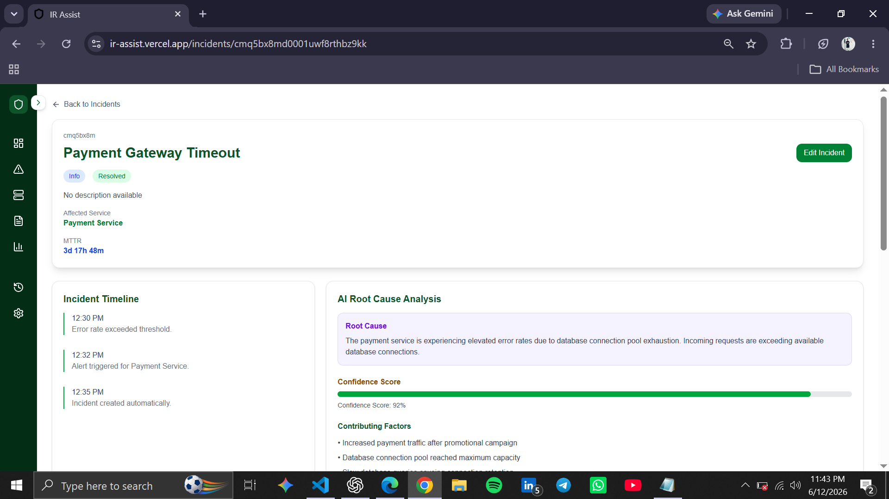
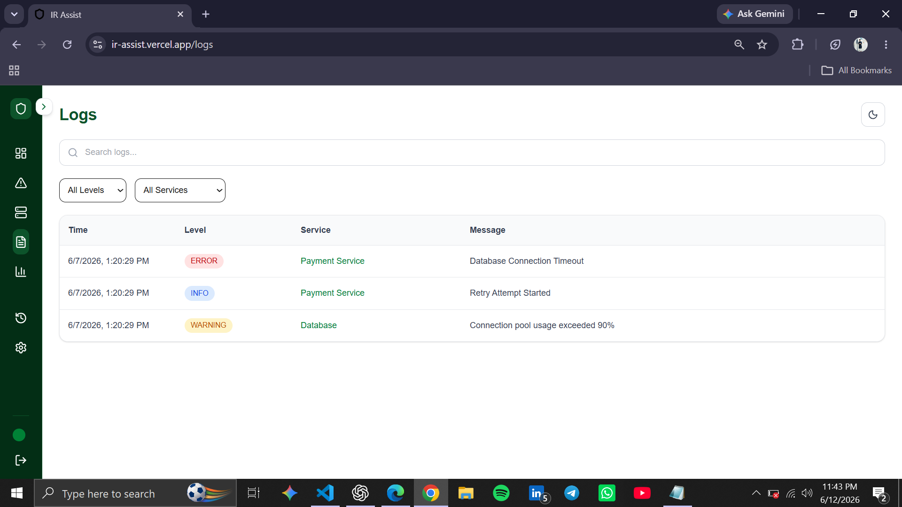
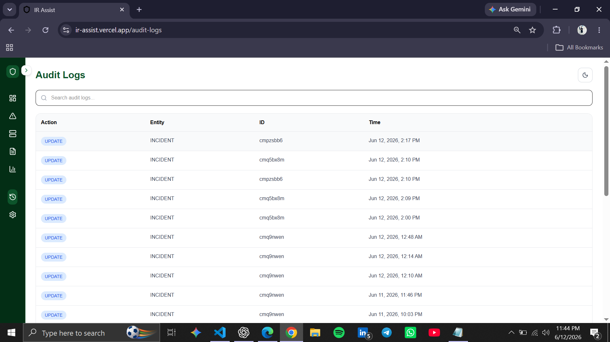

# IR Assist

# AI-Powered Incident Response & Observability Platform

IR Assist is a full-stack incident response and observability platform built with **Next.js, TypeScript, Prisma, and PostgreSQL**. It helps teams manage incidents, monitor service health, analyze logs, track operational metrics, and maintain audit trails through a modern and responsive interface.

The project is inspired by modern incident management and observability platforms and focuses on building production-style features with scalable architecture.

---

## Features

### Dashboard & Analytics

* System overview dashboard
* Service health monitoring
* Incident status distribution
* Incident trend analytics
* Top affected services
* MTTR (Mean Time To Resolution) analytics
* Real-time metric updates

### Incident Management

* Create, update and delete incidents
* Incident details page
* Severity and status tracking
* Service association
* Search and filtering
* Resolve incident workflow

### Incident Timeline

* Incident activity feed
* Timeline events
* Status change tracking
* Severity change tracking
* Service assignment tracking
* Resolution events
* Colored badges and icons

### Service Monitoring

* Service inventory
* Service details
* Health status tracking
* Response metrics
* Availability monitoring

### Logs Explorer

* Structured log viewer
* Search functionality
* Severity categorization
* Real-time log updates

### Notifications

* Notification center
* Unread notification count
* Incident notifications
* Real-time updates

### Role-Based Access Control (RBAC)

* Admin
* Engineer
* Viewer

### Audit Logs

Track system activities including:

* Incident creation
* Updates
* Resolution
* Deletion

### Exports

* CSV export
* PDF report generation

### User Experience

* Responsive design
* Dark mode support
* Smooth animations
* Interactive charts
* Modern UI

---

## Tech Stack

### Frontend

* Next.js 15
* React
* TypeScript
* Tailwind CSS v4

### Backend

* Next.js API Routes
* Prisma ORM
* PostgreSQL
* NextAuth

### UI & Visualization

* Recharts
* Framer Motion
* Lucide React

### Deployment

* Vercel

---

## Architecture

```
Frontend
├── Next.js App Router
├── Tailwind CSS
├── Recharts
└── Framer Motion

Backend
├── API Routes
├── Prisma ORM
├── PostgreSQL
└── NextAuth

Core Modules
├── Dashboard
├── Incident Management
├── Timeline Events
├── Service Monitoring
├── Notifications
├── Logs Explorer
├── Audit Logs
├── Analytics
└── Exports
```

---

## Screenshots

### Dashboard


### Incident Details



### Logs Explorer



### Audit Logs



---

## Installation

Clone the repository

```bash
git clone https://github.com/mridul2507/AI-Powered-INCIDENT-RESPONSE-PLATFORM.git
```

Install dependencies

```bash
npm install
```

Run development server

```bash
npm run dev
```

---

## Build

```bash
npm run build
```

---

## Live Demo

https://ir-assist.vercel.app/

---

## Project Status

### Current Stage

Production-Style Full-Stack Observability Platform

### Completed

* Dashboard Analytics
* Incident Management
* Service Monitoring
* Logs Explorer
* Notifications
* RBAC
* Audit Logs
* Timeline Events
* MTTR Analytics
* CSV Export
* PDF Export
* Real-Time Updates

---

## Upcoming Features

### AI

* AI Root Cause Analysis
* AI Incident Summaries
* AI Postmortem Generation
* AI Log Analysis
* AI Insights Dashboard

### Platform Enhancements

* Server-Sent Events (SSE)
* Multi-Tenant Organizations
* Advanced Analytics
* SLA Tracking
* MTTD Metrics

---

## Deployment

The application is deployed on Vercel.

---

## License

MIT
